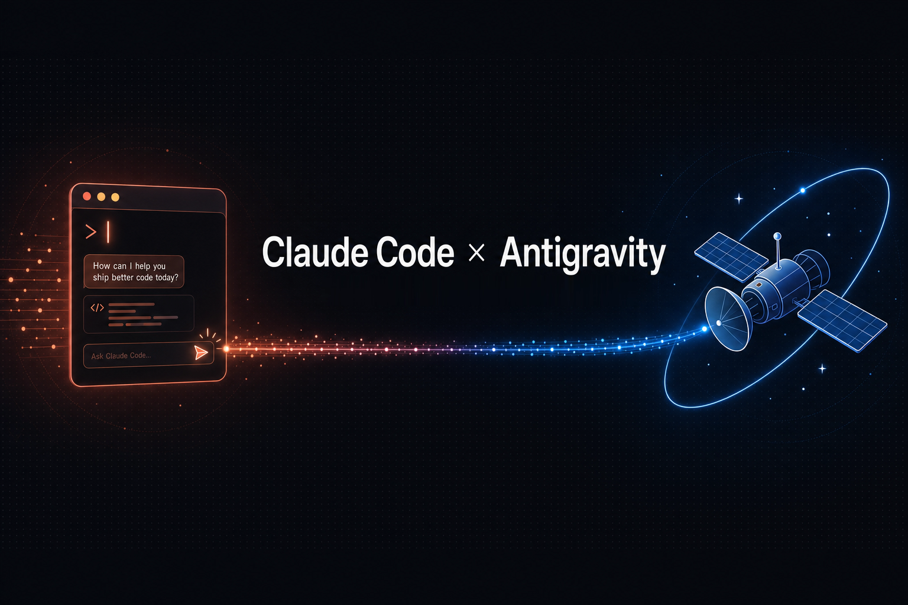

# 🛰️ antigravity-plugin-cc

<p align="center">
  
</p>

> Drive Google's Antigravity CLI (`agy`) without leaving Claude Code.

[](./LICENSE)
[](https://github.com/Idun-Group)
[](https://antigravity.google/docs/)
[](https://github.com/Idun-Group/antigravity-plugin-cc/pulls)

A Claude Code plugin that hands work to `agy` — Google's Antigravity CLI — and brings the result back into your session. You stay in Claude Code; Gemini becomes a second model on tap. Think of it as the Antigravity counterpart to [`openai/codex-plugin-cc`](https://github.com/openai/codex-plugin-cc).

---

## What you get

Seven slash commands, all under the `/antigravity:` namespace. Each one shells out to a small Node companion that wraps `agy` in headless (`-p`) mode and manages background jobs.

- **`/antigravity:setup`** — check that `agy` is installed and new enough, find its binary and version, and get a best-effort read on whether you're signed in. Never logs you in.
- **`/antigravity:delegate`** — hand a task to Antigravity. Write-capable by default; can be sandboxed or made read-only, and can run in the background.
- **`/antigravity:review`** — read-only cross-model review of your current diff (or `base...HEAD`). Sandboxed.
- **`/antigravity:resume`** — continue the most recent Antigravity conversation (or a specific one) with a follow-up.
- **`/antigravity:status`** — list background jobs for this repo, or inspect one.
- **`/antigravity:result`** — print the final output of a finished job, plus the conversation id and a resume hint.
- **`/antigravity:cancel`** — stop a running background job.

---

## Why

You already trust Claude Code for the loop you're in. Sometimes you want a different model in the room — a second opinion on a thorny diff, a second pair of hands on a parallel task, or simply a separate quota when you'd rather not spend yours.

This plugin makes that one slash command away:

- **Second opinion.** `/antigravity:review` sends your diff to Antigravity and reads its critique back. Different model, different blind spots — useful precisely because it isn't the model that wrote the code.
- **Second pair of hands.** `/antigravity:delegate` offloads a self-contained task (a refactor, a script, a migration) to `agy` while you keep working. Run it in the background and collect the result later.
- **Separate quota.** `agy` runs on your own local Antigravity auth and its own free-preview quota. Offloading to it doesn't draw down your Claude Code usage.

No new account, no API keys, no context switch. If you have `agy` installed and signed in, you have a second model.

---

## Requirements

- **`agy` >= 1.1.10** — the Antigravity CLI, installed and signed in (Google account, browser OAuth, free preview tier). See install one-liners below. Older builds silently ignore `--model`/`--effort` in headless runs and predate the JSON output format this plugin reads, so it refuses to run against them — `agy update` fixes that.
- **Node.js >= 18** — the companion is a small ESM script with zero runtime dependencies.

Install `agy`:

```bash
# macOS / Linux  →  installs to ~/.local/bin/agy
curl -fsSL https://antigravity.google/cli/install.sh | bash
```

```powershell
# Windows
irm https://antigravity.google/cli/install.ps1 | iex
```

Then sign in once, interactively (this opens a browser):

```bash
agy
```

In Claude Code you can do this without leaving the session — type `! agy`, complete the OAuth flow, then quit the TUI.

---

## Install

```text
/plugin marketplace add Idun-Group/antigravity-plugin-cc
/plugin install antigravity@idun-antigravity
/antigravity:setup
```

`/antigravity:setup` confirms `agy` is reachable and tells you what to fix if it isn't.

---

## Usage

### `/antigravity:review` ⭐

Cross-model review of your working tree. Read-only and sandboxed — `agy` reads the diff, it doesn't touch your files.

```text
/antigravity:review
/antigravity:review focus on error handling and edge cases
/antigravity:review --base main the auth refactor in this branch
```

Returns Antigravity's review of the embedded diff. Pair it with your own review for two models on one change.

`--base <ref>` reviews `<ref>...HEAD`, and includes your uncommitted changes as well — the heading says so as `<ref>...HEAD (+ working tree)`. A wide range will not fit in one prompt, because the prompt travels in argv and Windows caps a command line at 32,767 characters. The diff is then trimmed at a file boundary and the output tells you how many of the changed files were covered, so a partial review never reads like a full one. Narrow the range when you see that warning.

### `/antigravity:delegate` ⭐

Hand a task to Antigravity. Write-capable by default — it can edit files and run commands — so contain it when you want to.

```text
/antigravity:delegate add a --json flag to the export command and update the tests
/antigravity:delegate --read-only explain how the retry logic in client.ts works
/antigravity:delegate --sandbox draft a migration script for the new schema
```

Background flow — kick it off, keep working, collect later:

```text
/antigravity:delegate --background port the utils module from CommonJS to ESM
   → returns a job id, e.g. agy-l3k9zf-a8x2qd

/antigravity:status
   → agy-l3k9zf-a8x2qd   running   "port the utils module…"

/antigravity:status agy-l3k9zf-a8x2qd
   → agy-l3k9zf-a8x2qd   done

/antigravity:result agy-l3k9zf-a8x2qd
   → final output + conversation id + a /antigravity:resume hint
```

> Job ids look like `agy-<id>`; conversation ids are UUIDs (e.g. `f47ac10b-58cc-4372-a567-0e02b2c3d479`). `status`/`result`/`cancel` accept a job id, and default to the latest job when you omit it.

### `/antigravity:resume`

Continue the last Antigravity conversation (or a specific one) with a follow-up.

The thread is chosen from this plugin's own job records, scoped to this directory and to the Claude session that started them, and passed to `agy` as an explicit conversation id — the reply tells you which thread it picked up. If a job from the same directory is still running, the continue is refused rather than forking the thread; finish or cancel it first. `/antigravity:delegate` can continue a thread too, but it asks first unless you passed `--continue`, `--conversation <id>`, or `--fresh`.

```text
/antigravity:resume now add unit tests for the code you just wrote
/antigravity:resume --conversation f47ac10b-58cc-4372-a567-0e02b2c3d479 also handle the empty-input case
```

### `/antigravity:status` · `/antigravity:result` · `/antigravity:cancel`

```text
/antigravity:status                      # all jobs for this repo
/antigravity:result                      # latest finished job's output
/antigravity:cancel agy-l3k9zf-a8x2qd    # stop a running job
```

---

## How it works

The plugin is a thin layer over `agy`'s headless mode. Honestly, most of the value is in the plumbing:

- **Headless delegation.** Commands run `agy -p "<task>"` and stream the result back. `delegate` is write-capable; `review` is sandboxed and read-only.
- **Background jobs.** `--background` spawns a detached run, tracks it per-repo, and lets you poll with `status` / collect with `result` / stop with `cancel`.
- **Error surfacing — the differentiator.** A failed `agy` run is easy to mistake for a successful one, so the companion checks three signals in order: the **exit code** (non-zero is a confirmed failure since `agy` 1.1.1, but exit 0 proves nothing — 1.1.20 narrowed it to cascade-level failures), then the **JSON envelope** on stdout (`--output-format json`, which carries `status`, `error`, `conversation_id` and token usage), then the **log file** as a last resort for the case where stdout comes back empty on a non-TTY pipe. What you get is the real signal: `RESOURCE_EXHAUSTED (429) … Resets in <duration>`, auth failures, and backend errors, instead of a blank answer that looks like success.
- **Run cost on every response.** Each reply ends with a line like `6.0s · 31.7k in / 588 out / 470 thinking`. Quota exhaustion is the most common failure here, and this is the only warning you get before it happens.

  Reading it: the thinking and cached components appear only when they are non-zero. On a **continued** thread the first field is `turn 2` rather than a duration, because `agy` reports elapsed time since the conversation was created, not since this turn began — a resumed turn would otherwise claim to have taken forty minutes. And the input count is everything `agy` sent the model, not the size of your prompt: a review of a 12 KB diff spent 237k input tokens while a review of a 32 KB diff spent 63k, because what dominates is how much of the repo the agent chose to read, not how much you handed it.

**On model selection:** pass `--model <slug>` to `delegate`/`resume`/`review` to override the model for that session. Run `agy models` for the live catalog — the slugs move between releases, so don't copy one from memory. Most of them already encode a reasoning effort (`gemini-3.8-flash-high`); `--effort <low|medium|high>` is for the base model names that require one, and `agy` rejects a mismatched pair itself rather than silently picking. Without `--model` the run uses whatever `/model` set inside the TUI, persisted in its `settings.json`.

**Two more escape valves:** `--no-slash-commands` stops `agy` expanding its own slash commands and skills in your prompt (they stay enabled by default, so an `agy`-side skill can fire), and `--agy-arg <token>` passes one raw token straight through to `agy` — repeat it per token, e.g. `--agy-arg --mode --agy-arg plan` — for flags this plugin doesn't wrap yet.

---

## Troubleshooting / FAQ

**"RESOURCE_EXHAUSTED" / quota exhausted.**
You've hit the free-preview limit. The quota is **per Google account** (`agy` reports *"Individual quota reached"*), and the companion tells you when it resets (e.g. *"Resets in 152h"*). Options: wait for the reset, or sign `agy` into a different Google account (`! agy`, then sign in). Claude Code can keep handling the task itself in the meantime. This is a preview-tier limit, not a bug.

**Empty output but no error.**
Almost always quota. The companion reads the JSON envelope, and falls back to `agy`'s log when stdout comes back empty, so it should report the `RESOURCE_EXHAUSTED` reset time rather than a blank answer. If you genuinely get nothing, the log path is printed with the error — open it.

**"Not authenticated" / setup says you're not signed in.**
Run `agy` once interactively to complete the Google browser OAuth: in Claude Code, type `! agy`, sign in, then quit. The plugin never authenticates for you.

**`agy` is in a custom path.**
The companion looks on `PATH`, then `~/.local/bin/agy` (and `%LOCALAPPDATA%gyin` on Windows). To point it elsewhere, set `ANTIGRAVITY_CC_AGY_BIN` to the full path of your binary.

**"agy is too old".**
The plugin needs `agy` >= 1.1.10. Run `agy update`, then `/antigravity:setup`. It refuses rather than running with flags an older build would accept and discard.

**Do I need a separate account or an API key?**
No. There's no API key for the preview tier. The plugin uses whatever local `agy` auth you already have — sign in once with your Google account and you're set.

**A background job is stuck.**
`/antigravity:status agy-<id>` to inspect it, `/antigravity:cancel agy-<id>` to stop it.

---

## Relationship to Antigravity's own plugins

`agy` has its own plugin system and can even import Claude-compatible plugins (`agy plugin import claude`). That's the *other* direction — extending Antigravity with Claude-shaped tooling.

This project lives on the **Claude Code side**: it lets Claude Code drive `agy`. The two are complementary; neither requires the other.

---

## Credits

Built and maintained by **[Idun Labs](https://github.com/Idun-Group)** — makers of an [open-source platform for governing AI agents in production](https://idunplatform.com).

- Antigravity CLI docs → https://antigravity.google/docs/cli-overview
- Inspiration → [`openai/codex-plugin-cc`](https://github.com/openai/codex-plugin-cc)

Licensed under [MIT](./LICENSE). PRs welcome.

Independent project. Not affiliated with, endorsed by, or sponsored by Google or Anthropic. "Antigravity", "Gemini", and "Claude Code" belong to their respective owners.
